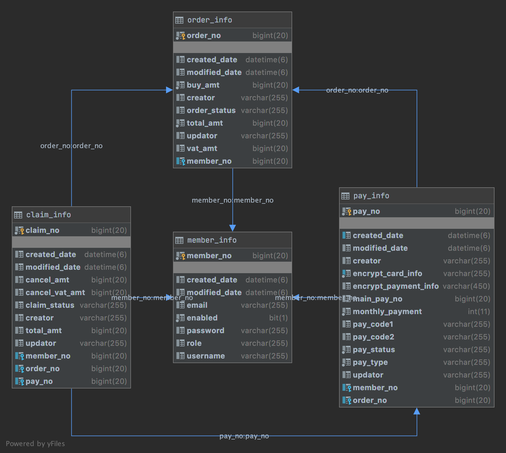

# Rest API 기반 결제시스템
- 결제, 결제취소요청을 받아서 string 데이터로 카드사와 통신하는 서비스를 개발하려고 합니다.
- 아래 기능명세에 대한 결제시스템 API를 개발하고 Test 코드를 작성하세요.

## 목차

[개발환경](#개발환경)

[빌드와실행하기](#빌드와실행하기)

[기능요구사항](#기능요구사항)

[개발조건](#개발조건)

[해결방법](#해결방법)

---
## 개발환경
- 기본 환경
    - IDE: IntelliJ IDEA
    - OS: Mac OS X
    - GIT
    - POSTMAN
- Server
    - Java 14
    - Spring Boot 2.4.0
    - JPA
    - H2
    - Gradle
    - Junit5
    - Swagger2

## 빌드와실행하기
```
$ git clone https://https://github.com/chszard/interview
$ cd interview
$ ./gradlew clean build
$ java -jar build/libs/interview-0.0.1-SNAPSHOT.jar
```

## 기능요구사항
### 1. 결제 API
- 카드정보과 금액정보를 입력받아서 카드사와 협의된 string 데이터로 DB에 저장합니다.

### 2. 결제취소 API
- 결제에 대한 전체취소는 1번만 가능합니다.
- 부가가치세 정보를 넘기지 않는 경우, 결제데이터의 부가가치세 금액으로 취소합니다.
- 할부개월수 데이터는 00(일시불)로 저장합니다.

### 3. 데이터 조회 API
- DB에 저장된 데이터를 조회해서 응답값으로 만들어줍니다.
- request : 관리번호(unique id)

## 개발조건
- 암호화된 카드 정보 복호화
- 450자 데이터로 통신사 전문 생성


## 해결방법
### ERD 구성


### 사용자를 생성한다
request
```
http://localhost:8080/v1/member/create
```
response
```
{
  "createdDate": "2020-06-24T08:32:09.367455",
  "modifiedDate": "2020-06-24T08:32:09.367455",
  "memberNo": 1,
  "username": "username",
  "password": "123456",
  "email": "aaa@aaa.com",
  "role": "ROLE_USER",
  "enabled": true
}
```
### 주문을 생성한다, 결제데이터도 동시에 생성된다.
request
```
http://localhost:8080/v1/1/order/create

{
  "cardNo": "1234567890",
  "cvc": "030",
  "expirationDate": "0424",
  "monthlyPayment": 0,
  "totalAmt": 11000,
  "vatAmt": null
}
```
response
```
// 주문
{
  "createdDate": "2020-06-24T08:36:50.75542",
  "modifiedDate": "2020-06-24T08:36:50.784798",
  "orderNo": 1,
  "member": {
    "createdDate": "2020-06-24T08:32:09.367455",
    "modifiedDate": "2020-06-24T08:32:09.367455",
    "memberNo": 1,
    "username": "username",
    "password": "123456",
    "email": "aaa@aaa.com",
    "role": "ROLE_USER",
    "enabled": true
  },
  "totalAmt": 11000,
  "buyAmt": 10000,
  "vatAmt": 1000,
  "orderStatus": "AV",
  "creator": "username",
  "updator": "username"
}
```

### 결제 내역 조회
Request
````
http://localhost:8080/v1/1/pay/1
````

Response
```

{
  "payType": "PAYMENT",     // 결제
  "payNo": 1,               // 결제 관리번호
  "cardNo": "123456*890",   // 마스킹 앞자리 6, 뒷자리3 빼고 나머지.
  "monthlyPayment": "0",
  "expirationDate": "0424",
  "cvc": "030",
  "totalAmt": 11000,
  "vatAmt": 1000,
  "mainPayNo": 1,
  "etc": "",
  "claimNo": null,
  "orderNo": 1,
  "encryptPaymentInfo": " 446PAYMENT   1                   1234567890          000424030     110000000001000                    MTIzNDU2Nzg5MDwwNDI0PDAzMA==                                                                                                                                                                                                                                                                                                                               "
}
```

### 취소 데이터 생성
Request
````
http://localhost:8080/v1/1/claim/create
{
  "cancelTotalAmt": 1000,
  "cancelVatAmt": 91,
  "orderNo": 1
}
````
Response
```
{
  "createdDate": "2020-06-24T08:44:11.224991",
  "modifiedDate": "2020-06-24T08:44:11.243743",
  "claimNo": 1,
  "member": {
    "createdDate": "2020-06-24T08:32:09.367455",
    "modifiedDate": "2020-06-24T08:32:09.367455",
    "memberNo": 1,
    "username": "username",
    "password": "123456",
    "email": "aaa@aaa.com",
    "role": "ROLE_USER",
    "enabled": true
  },
  "claimStatus": "AV",
  "totalAmt": 1000,
  "cancelAmt": 909,
  "cancelVatAmt": 91,
  "updator": user,
  "creator": user
}
```
### 결제 취소 내역 조회
Request
````
http://localhost:8080/v1/1/pay/1
````

Response
```

{
  "payType": "CANCEL",      // 결제 취소
  "payNo": 2,               // 결제 관리번호
  "cardNo": "123456*890",   // 마스킹 앞자리 6, 뒷자리3 빼고 나머지.
  "monthlyPayment": "0",
  "expirationDate": "0424",
  "cvc": "030",
  "totalAmt": 11000,        // 원 결제내역
  "vatAmt": 1000,           // 원 결제내역
  "mainPayNo": 1,           // 원 결제 관리번호
  "etc": "",
  "claimNo": 1,             // 결제 취소 데이터 저장내역
  "orderNo": 1,             // 주문번호
  "encryptPaymentInfo": " 446CANCEL    2                   1234567890          000424030     1100000000010001                   MTIzNDU2Nzg5MDwwNDI0PDAzMA==                                                                                                                                                                                                                                                                                                                               "
}
```
* swagger UI 참고
http://localhost:8080/swagger-ui.html


### 멀티 스레드 환경 대비
- 동시에 같은 카드로 구매 불가
```
pay_info 테이블의 created_date 필드와 카드정보 암호화 필드(encrypt_card_info) 를 복합 유니크 키로 등록함.

test.java.syncTest.syncOrderTest 에서
병렬로 호출해서 테스트함.

BaseEntity createdDate 주석 지우고
주문 생성시에 강제로 동일 localdatetime 고정한 뒤 테스트.
Duplicate entry '2020-06-22 15:00:00.000000-MTIzNDU2Nzg5MDwwNDI2PDAzMA==' for key 'UK4nurd7rg8jfsbqvleq0h04pjm'

test.java.syncTest.syncOrderTest 에서
병렬로 호출해서 테스트함.[O]
```

- 동시에 결제취소 불가
``` 
test.java.syncTest.syncCancelOrderTest 에서
병렬로 호출해서 테스트함.[O]
결제취소 API 호출부의 @Transaction Isolation level을 Serializable로 지정
```

### 부분취소 API를 구현하고 Test Case를 통과시켜주세요.
- 모든 취소 API 는 인터페이스가 동일하며, 금액으로 전체취소, 부분취소로 나뉨.
```
TestCase 1: 
test.java.TotalIntegrateSenarioTest1
- [O] 결제
- [O] 부분취소 성공
- [O] 부분취소 성공
- [O] 부분취소 실패
- [O] 부분취소 실패
- [O] 부분취소 성공
- [O] 부분취소 실패
```
```
TestCase 2
test.java.TotalIntegrateSenarioTest2
- [O] 결제
- [O] 부분취소 성공
- [O] 부분취소 실패
- [O] 부분취소 성공
```
```
TestCase 3
test.java.TotalIntegrateSenarioTest3
- [O] 결제
- [O] 부분취소 성공
- [O] 부분취소 실패
- [O] 부분취소 실패: 문제 예시가 잘못됨
부분취소 금액 10000의 부가세 null 인 경우 909임.
따라서 남아있는 부가세인 818 보다 취소하려는 금액이 커서 실패.
```